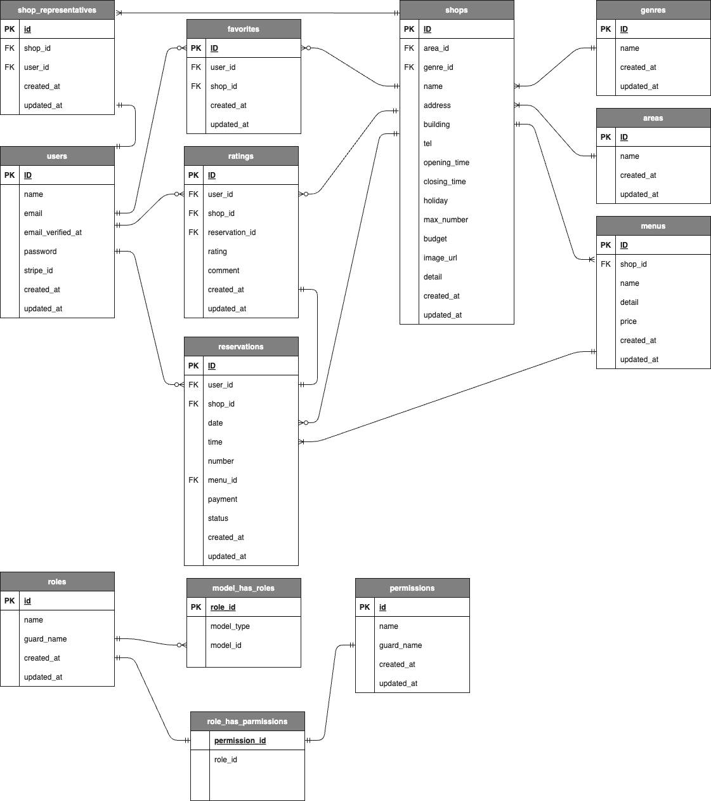

# Rese
飲食店予約システム
ログイン後、店舗の予約やお気に入り登録、来店履歴の閲覧、レビューの投稿ができます。
<br>
管理者権限と店舗代表者権限を作成しそれぞれ機能を切り分けました。
<br>
リマインドメールに添付されるQRコードは、お店側で読み取ることで店舗代表者が確認できる予約リストに「来店」として更新されます。
<br>
### TOPページ


## 作成した目的
学習のアウトプットのため
<br>
企業の飲食店予約システムを作成
<br>
<br>

## 機能一覧
### 一般ユーザー
|会員登録画面|ログイン画面|
| --- | --- |
|||
|名前、メールアドレス、パスワードを入力すると登録できます。|メールアドレス、パスワードを入力するとログインできます。|

|トップ画面|店舗詳細画面|
| --- | --- |
|||
|エリア、ジャンル、ワードで店舗を検索できます。ハートマークをクリックすることでお気に入り登録や削除ができます。詳しく見るボタンをクリックすると店舗詳細画面に移ります。|店舗詳細情報やメニュー、レビュー内容を閲覧できます。日付、時間、人数などを入力して予約できます。|

|マイページ画面|来店履歴画面|
| --- | --- |
|||
|本日分以降の予約情報が表示されます。editボタンをクリックで予約の変更、×ボタンをクリックで予約のキャンセルができます。お気に入り登録している店舗が表示されます。ハートマークをクリックするとお気に入り登録を削除できます。|過去の来店履歴を閲覧できます。右のレビュー投稿ボタンをクリックし、評価とコメントを入力するとレビューを投稿できます。|

### 管理者
|管理者登録画面|店舗代表者登録画面|
| --- | --- |
|||
|管理者登録専用画面です。名前、メールアドレス、パスワードを入力すると管理者権限が付与され登録できます。|店舗代表者登録専用画面です。名前、メールアドレス、仮パスワード、店舗を入力すると店舗代表者権限が付与され登録できます。一つの店舗に複数人の店舗代表者を登録できます。|

|ユーザーリスト画面|メール送信画面|
| --- | --- |
|||
|権限、店舗、ワードで検索できます。権限が付与されているユーザーには削除ボタンが表示され、クリックすると権限の削除ができます。|全ユーザー、一般ユーザー、店舗代表者、管理者の中から宛先を選択し、本文を入力して寿司んボタンをクリックするとメール送信できます。|

### 店舗代表者
|本パスワード登録画面|店舗情報作成・編集画面|
| --- | --- |
|||
|管理者側で店舗代表者を登録すると、登録完了メールが送信されます。メールに記載のリンクからログインすると本パスワード登録画面に移りますのでメールアドレス、現在のパスワード、新しいパスワードを入力すると登録されます。|店舗情報の作成、編集ができます。既に店舗情報を登録している場合は登録されている情報が表示されます。|


|メニュー作成・編集画面|予約リスト画面|
| --- | --- |
|||
|上の欄で店舗メニューを作成できます。下の欄に登録しているメニューが表示され、それぞれ編集、削除ができます。|日別の予約リストが閲覧できます。来店時に予約者に送られるリマインダーメールのQRコードを読み込むと予約リストに「来店」として反映されます。|

### 共通機能
|ログアウト機能|メール認証機能|
| --- | --- |
|ログアウトボタンでサイトからログアウトできます。|会員登録時に本人確認のためのメールが送信されます。認証ボタンをクリックしログインできます。|


## 実行環境
Docker 26.1.1
<br>
nginx 1.21.1
<br>
php 8.3.8
<br>
mysql 8.0.26
<br>
phpMyAdmin 5.2.1
<br>
Mailhog

## 使用技術
Laravel Framework 8.83.8
<br>
Laravel Livewire
<br>
HTML/CSS
<br>
Javascript
<br>
PHP
<br>

## テーブル設計
<br>

<br>

## ER図


## 環境構築

#### Docker ビルド

```
git clone githubのリンク
```

```
docker-compose up -d --build
```

> _Mac の M1・M2 チップの PC の場合、`no matching manifest for linux/arm64/v8 in the manifest list entries`のメッセージが表示されビルドができないことがあります。
> エラーが発生する場合は、docker-compose.yml ファイルの「mysql」内に「platform」の項目を追加で記載してください_

```bash
mysql:
    platform: linux/x86_64(この文追加)
    image: mysql:8.0.26
    environment:
```

<br>
<br>

#### Laravel環境構築
  1. PHPコンテナへ入る
  ```
  docker-compose exec php bash
  ```
  <br>

  2. composer をインストール
  
  ```
  composer install
  ```

  <br>
  
  3. .env.example ファイルをコピーして.env ファイルを作成し、環境変数を変更する(docker-compose.ymlを参照)
  
  ```
  cp .env.example .env
  ```

  <br>
  
  ```
  DB_CONNECTION=mysql
  DB_HOST=mysql(変更)
  DB_PORT=3306
  DB_DATABASE=laravel_db(変更)
  DB_USERNAME=laravel_user(変更)
  DB_PASSWORD=laravel_pass(変更)
  ```
  <br>

  4. アプリケーションキーを取得
  
  ```
  php artisan key:generate
  ```
  
  <br>
  
  5. テーブル作成
  
  ```
  php artisan migrate
  ```

  <br>
  
  6. ダミーデータ作成
  
  ```
  php artisan db:seed
  ```
  
  <br>
  <br>
  ## URL

- 開発環境
  - ログインページ <http://localhost/login>
- MailHog <http://localhost:8025>
- phpMyAdmin <http://localhost:8080>


